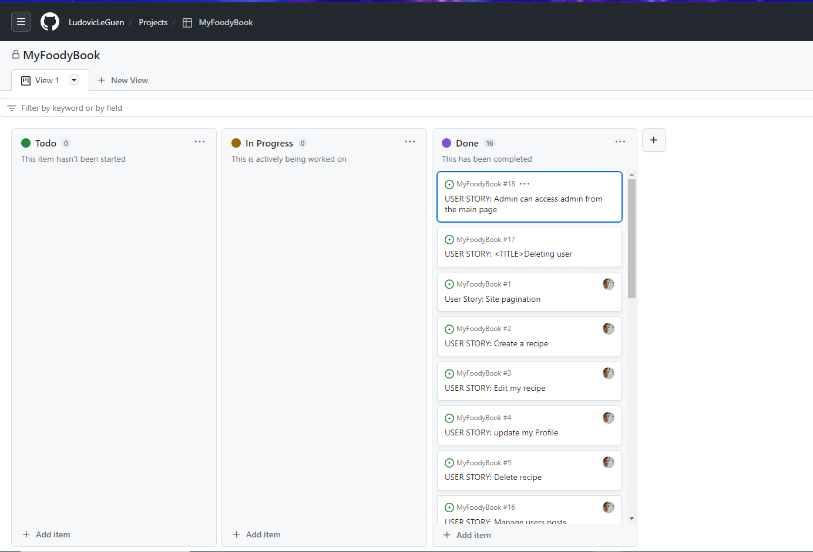

# My-foody-book

My Foody Book is a full stack web application where users can create and store their recipes and also collect other users one. 

The purpose of the site is to offer a convenient platform to store recipes and also be inspired by others. 

The audience is simple: Food lovers of all ages who love sharing and showing what they can do in a kitchen. 

The Website is based on CRUD fucntionnality and allow users to create, read, update and delete their own recipes (except for admins). User can also collect and discard others users recipes. Finally, users can create and update their profiles.

My Foody Book also provides an administration exclusively accessible by admins that can manage comments and moderate the platform.

[Click here to access live project](https://the-wheel-of-fortune.herokuapp.com/)
## Table of contents
1. [Introduction](#Introduction)
2. [UX](#UX)
    1. [Ideal User Demographic](#Ideal-User-Demographic)
    2. [User Stories](#User-Stories)
    3. [Development Planes](#Development-Planes)
    4. [Design](#Design)
3. [Features](#Features)
    1. [Design Features](#Design-Features) 
    2. [Existing Features](#Existing-Features)
    3. [Features to Implement in the future](#Features-to-Implement-in-the-future)
4. [Issues and Bugs](#Issues-and-Bugs)
5. [Technologies Used](#Technologies-Used)
     1. [Main Languages Used](#Main-Languages-Used)
     3. [Frameworks, Libraries & Programs Used](#Frameworks,-Libraries-&-Programs-Used)
6. [Testing](#Testing)
     1. [Testing.md](TESTING.md)
7. [Deployment](#Deployment)
     1. [Deploying on GitHub Pages](#Deploying-on-GitHub-Pages)
8. [Credits](#Credits)
     1. [Media](#Media)
     2. [Code](#Code)
9. [Acknowledgements](#Acknowledgements)
***

## Introduction
My Foody Book is the 4th project for Code Institute's full stack development degree.
The minimum requirements of this project are:
* Use an Agile methodology to plan and design a Full-Stack Web application using an MVC framework and related contemporary technologies.
* Implement a data model, application features and business logic to manage, query and manipulate data to meet given needs in a particular real-world domain.
* Identify and apply authorisation, authentication and permission features in a Full-Stack web application solution.
* Create manual and/or automated tests for a Full-Stack Web application using an MVC framework and related contemporary technologies
* Use a distributed version control system and a repository hosting service to document, develop and maintain a Full-Stack Web application using an MVC framework and related contemporary technologies.
* Deploy a Full-Stack Web application using an MVC framework and related contemporary technologies to a cloud-based platform
* Understand and use object-based software concepts

[Back to top ⇧](#My-foody-book)

## UX
### Ideal User Demographic
The users targeted have to be food lovers who enjoy sharing their ideas and creativity. 
There will be 2 main category users
Frequent food aficionados who love creating and sharing and want to store there recipes.
New users who simply want to be inspired.

### User-Stories
#### Frequent User Goals
* Frequent users want to see the recipes they have created and collected
* Frequent users want to log in with their usual credentials
* Frequent users want to see other users recipes
* Frequent users want to manage their FoodyBook

#### New User Goals
* New Users want to be able to see some of the content before registering
* New users want to understand what the site is about within seconds
* New users want to understand the functionalities quickly.

#### Site Administrators
* The admnistrators needs to control all aspects of the site
* The admins can remove users
* The admins need to moderate comments
* The admon needs to navigate between the site and admin easily.

#### Development Methodology
* The development followed an Agile methodology on the [Foody Book github Project](https://github.com/users/LudovicLeGuen/projects/4 "Link to the Foody Book github Project")

* All project database was base on the following Database Shema.

[Back to top ⇧](#My-foody-book)

### Development-Planes

The website has to answer the aforementioned needs of all users types and therefore must contain a a variety of CRUD finctionality for the recipes and a user profile management system. Furthrmoe, a simple yet intuitive collection method of recipe must be omplemented. Finally, an interactivity must be created trhough a comment section.

#### Strategy
The website will focus on the following target audience
* Audience
    * New Users
    * Frequent users
    * Food lovers with creativity
    * Curious people 
    * Serious cooks with the need to store content.
    
* Demographic
    * Adults 
    * Young adults
    * Independant adults
    * Beginner cooks
    * Artistic and creative people
    
* Psycho Characteristics
    * Sociable
    * Epicurian
    * Curious
    * Food knowledge

* The Users must find thisinformation:
    * The name of the recipe
    * The time it takes to cook it
    * The ingredients
    * The number of people it feeds
    * The steps to cook the dish
    * A picture of the dish
    * The number of people who collected it
    * The author of the recipe
    * The profile of the author
    * The possibility to Log in Log out or register
    * the possibility to post comments
    * A view of the previous comments

    
* The Administrator has to receive these information:
    * The name of the users
    * The profile of the users
    * The Recipes
    * The comments
    * the possibility to delete and manage all of the above

#### Scope

Now that we have established the goals of the website we can deduce the necessary features and content:
* Required Content
    * A quick description of the purpose of the site
    * Recipes by users 
    * Users profile

* Required functionality
    * A form to register
    * A form to login with the same credentials
    * A form to log out
    * An automatic profile creation
    * A form to update a profile
    * A page to show a profile
    * a page to show all profiles
    * A form to create a recipe
    * A form to update a recipe
    * A form to delete a recipe
    * A Page to display all recipes
    * A method to collect a recipe
    * A method to discard a recipe
    * A method to comment a recipe
    * An administration to manage the site

[Back to top ⇧](#My-foody-book)

#### Structure

The website will consist of 1 pages. 

   1. **A Home page** with the purpose of the site for first users and the recipe content or the logged in users.     
   2. **A Foodybook page** with your created and collected recipes.
   3. **A Register page** to register on the site.
   4. **A Log in page** to log in with your credentials.
   5. **A log out page** to confirm if users want to leave.
   6. **A profile page** to show your Bio and your recipe too.This will act as the user foodybook
   7. **An update profile page** to change your bio
   8. **An all users page** to show all users.
   9. **An create recipe page** to create your recipes
   10. **An update recipe page** to update your recipes
   11. **A delete recipe page** to confirm your action
   12. **An admin page** for admins

With the needed structure defined the developper has created the following Wireframes.

[Back to top ⇧](#My-foody-book)

### Skeleton

Home Page

    

 

All recipe page

    

 

Landing page

    

 

Profile page

    

 

Login

    

 

Register page

    

 

My Foody Book page

    

 

My Foody Book page no recipe

    

 

[Back to top ⇧](#My-foody-book)

## Features
### Existing Features

[Back to top ⇧](#My-foody-book)

### Features to Implement in the future

[Back to top ⇧](#My-foody-book)

## Issues and Bugs 
Several issues were encountered during developpement but the most troublesome are listed below.

**Bankrupt would reset the player overall gains instead of the player round earnings** 

### Unfixed Bugs 

[Back to top ⇧](#My-foody-book)

## Technologies Used
### Main Languages Used
* Python3
### Frameworks, Libraries & Programs Used
- [Heroku](https://heroku.com/ "Link to Heroku") was used to deploy the game.
- [GitPod](https://gitpod.io/ "Link to GitPod homepage") was used for writing, commiting, and pushing code.
- [GitHub](https://github.com/ "Link to GitHub")
- [Am I Responsive?](http://ami.responsivedesign.is/# "Link to Am I Responsive Homepage") was used to verify responsiveness and to create the top picture of this README.md

[Back to top ⇧](#My-foody-book)

## Testing
Refer to this [page](TESTING.md) please

## Deployment
The site was developped on Gitpod and Codeanywhere, commiting and pushing to github.

### Deploying on Heroku
Deploying on Heroky required the following:

* Type "pip freeze > requirements.txt" in your Github terminal to update the requirements.txt file with the list of dependencies used in the project . Save, commit and push.

* Create an Heroku account, select Python as the 'Primary development language'.

* Open the email sent to your address and click the link to verify your email address. Follow the instructions to create a password and log in.

* Click the 'create new app' button on the dashboard. Name your app, select your region and click 'Create App'

* In the "Settings" tab, add both the python and node.js build packs.

* Create a "Config VAR" named 'CREDS' KEY and copy/paste the creds.json file in it.

* Create another "Config VAR" called PORT as the KEY with 8000 as VALUE.

* In the "Deploy" tab, choose GitHub as a deployment method.

* Search for the wanted repository.

* Click on "enable automatic deploys" and then deploy branch.

* once the app built (a minute or two needed)click "View" to access the site.
   
[Back to top ⇧](#My-foody-book)

## Credits 
### Code 
The developer has consulted countless times Stack Overflow and W3Schools in ordeer to build the game.
The code inspired by other developpers is commented directly in the code.

[Back to top ⇧](#My-foody-book)

## Acknowledgements
I would like to thank:
* My wife  for her patience and her kind words when I was in doubt.
* my mentor, Seun, for her counseling and her contagious enthusiasm and love for coding.
* my fellow coding students of Code institue who have been invaluable on Slack.

[Back to top ⇧](#My-foody-book)

***