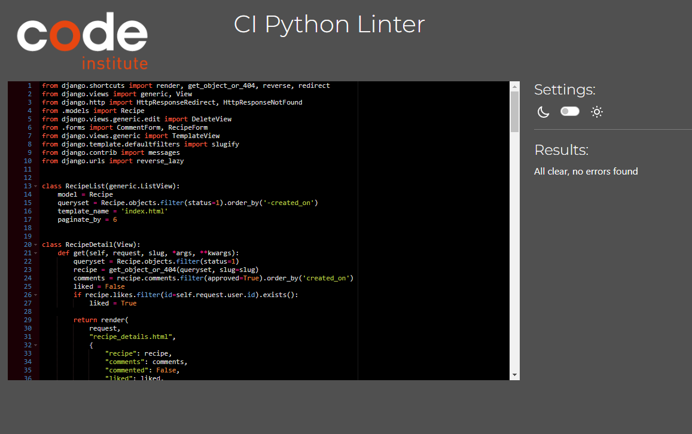

# My-foody-book - Testing 

[Main README.md file](/README.md)

[View live project](https://the-wheel-of-fortune.herokuapp.com/)

***
## Table of contents
1. [Testing User Stories](#Testing-User-Stories)
2. [Manual Testing](#Manual-Testing)
3. [Automated Testing](#Automated-Testing) 
     - [Code Validation](#Code-Validation)
4. [User Testing](#User-Testing)

***

## Testing User Stories
#### Frequent User Goals:
* As a frequent user want to see the recipes they have created and collected
     * The foody book page allows users to see their own published, secret and collected recipes
     * the user can see all tehir published recipes in the All recipe page

* As a frequent user want to log in with their usual credentials
     * The credentials are stored if necessary.
     * The the credentials are always the same to log in
     
* As a frequent user want to see other users recipes
     * All recipes are visible in the All Recipe page. 
     * The user can also watch other users foodybook to see their published recvipes and collection

* As a frequent users want to manage their FoodyBook
     * All recipes can be updated, deleted or created everywhere on the site
     * Any recipe can be managed according to the users status (author or reader)

#### New User Goals:
* As a New Users want to be able to see some of the content before registering
     * A message explain sthe purpose of the site
     * The foody bookers page is visible

* As a New users want to understand what the site is about within seconds
     * A clear message explains the purpose of the site. 

* As a new users want to understand the functionalities quickly..
     * The functions are pretty clear and pretty simple. 
     * Only very pages and very vew functionalities help keep things simple
     * the buttons on the recipes are also clear to understand

[Back to top ⇧](#My-foody-book---Testing)
## Manual Testing
### Login Logout Register
* LogIn

      

* Logout

     

* Register

     
     

### Phase 2 The game
* Creating and displaying the Mystery Sentence

     

* Turning the wheel

     

* Cash value

     

* Pass your turn

     

* Bankrupt

      

* Inserting a consonant

      

* Verify the consonant

      

* Consonant already guessed

      

* No more consonant to chose

     

* Print consonant

      

* Calculate turn earning

      
     

* 3 choices after correct guess

      

* buy a vowel

     

* Not enough money to buy Vowel

     

* guess sentence

     

* Winning round

     

* Last round

     

* Winning Game

      
     

[Back to top ⇧](#My-foody-book---Testing)

## Automated Testing
### Code Validation
* PEP8 CI Python Linter 

| Page              |  Result                                                                    | Comment|
| :---              |      :---:                                                                 | :---:  |
| publish app url   |       | pass   |
| publish app admin |    | pass   |
| publish app forms |    | pass   |
| publish app views |     | pass   |
| user app url      |            | pass   |
| user app signals  |     | pass   |
| user app models   |        | pass   |
| user app views    |          | pass   |

* CSS validator

* Javascript
My javascript is a few lines long.
I tested it on [esprima](https://esprima.org/image.png)

[Back to top ⇧](#My-foody-book---Testing)

## User testing 
Special thanks to the following who tested and gave me their feedback and ideas to improve the game:
* My wife Domnika 
* Ed bradley, as usual
* My Mentor Koko The champion of the wheel of fortune. Really lads she is unbeatable.....

***